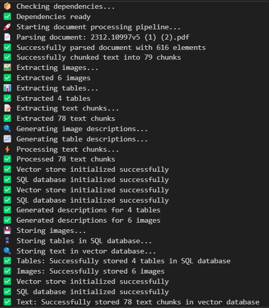

# 🤖 Multimodal PDF Processing & Query System

A sophisticated AI-powered system for processing complex PDF documents containing text, images, and tables, with an intelligent multi-agent query interface.



## 🌟 Features

### 📄 **Advanced PDF Processing**
- **High-resolution document parsing** using Unstructured library
- **Multi-modal content extraction**: Text, images, tables, and figures
- **Parallel processing pipeline** with LangGraph orchestration
- **Semantic text chunking** for optimal retrieval

### 🤖 **Intelligent Multi-Agent System**
- **Supervisor Agent**: Orchestrates query routing and response synthesis
- **Text Analysis Agent**: Handles text-based queries with academic rigor
- **Image Analysis Agent**: Processes visual content and descriptions
- **Table Analysis Agent**: Analyzes structured data and identifies patterns

### 💾 **Multi-Modal Storage**
- **Vector Database (ChromaDB)**: Semantic similarity search for text and images
- **SQL Database (SQLite)**: Structured storage for tables and metadata
- **File System**: Original images and detailed metadata preservation

### 🎨 **Modern Web Interface**
- **Streamlit-based UI** with professional styling
- **Real-time agent workflow visualization**
- **Token usage tracking** for cost awareness
- **System health monitoring** with status indicators


## 🏗️ System Architecture

### **Phase 1: Document Processing Pipeline**
```
PDF Input → Parse Document → Extract Content (Parallel)
    ├── Images → Describe → Store in Vector DB
    ├── Tables → Analyze → Store in SQL DB
    └── Text → Process → Store in Vector DB
```

### **Phase 2: Multi-Agent Query System**
```
User Query → Supervisor Agent → Route to Specialist
    ├── Text Analysis Agent (Vector Retrieval)
    ├── Image Analysis Agent (Image Search)
    └── Table Analysis Agent (SQL Queries)
```

## 🚀 Quick Start

### **Prerequisites**
- Docker and Docker Compose
- Groq API Key
- Python 3.11+ (for local development)

### **1. Clone Repository**
```bash
git clone <repository-url>
cd datalunatic69-multimodel_pdf
```

### **2. Environment Setup**
Create a `.env` file:
```bash
GROQ_API_KEY=your_groq_api_key_here
MODEL_NAME=llama3-70b-8192
```

### **3. Docker Deployment (Recommended)**

#### **Production Mode**
```bash
# Build and run the application
docker-compose up --build

# Access the application at http://localhost:8501
```

#### **Development Mode**
```bash
# Run with hot reload for development
docker-compose --profile dev up --build

# Access at http://localhost:8502
```

### **4. Local Development**
```bash
# Install dependencies
pip install -r requirements.txt

# Set environment variables
export GROQ_API_KEY=your_key_here
export MODEL_NAME=llama3-70b-8192

# Process a document
python main.py

# Run Streamlit interface
streamlit run streamlit_app/main.py
```

## 📖 Usage Guide

### **1. Document Processing**
```python
from utilse import process_document, print_summary

# Process a PDF document
result = process_document("path/to/your/document.pdf")

# Print processing summary
if result:
    print_summary(result)
```

### **2. Web Interface**
1. **Upload/Process Documents**: Use the document processing pipeline
2. **Ask Questions**: Natural language queries about your documents
3. **View Responses**: Formatted answers with agent workflow details
4. **Monitor System**: Check component health in the sidebar

### **3. Query Examples**
- **Text Queries**: "What is the main methodology described in this paper?"
- **Image Queries**: "Describe the figures showing the system architecture"
- **Table Queries**: "What are the performance metrics in the results table?"
- **Mixed Queries**: "How do the images relate to the experimental results?"

## 🔧 Configuration

### **Environment Variables**
| Variable | Description | Default |
|----------|-------------|---------|
| `GROQ_API_KEY` | Your Groq API key | Required |
| `MODEL_NAME` | LLM model to use | `llama3-70b-8192` |
| `STREAMLIT_SERVER_PORT` | Web interface port | `8501` |

### **System Settings**
Modify `streamlit_app/config/settings.py` for:
- UI colors and gradients
- Response processing parameters
- Token usage limits
- Agent prompts and behavior

## 📁 Project Structure

```
datalunatic69-multimodel_pdf/
├── 🐳 Docker Configuration
│   ├── Dockerfile                   # Main container definition
│   ├── docker-compose.yml           # Multi-service orchestration
│   └── .dockerignore               # Docker build exclusions
├── 📄 Core Processing
│   ├── main.py                     # Document processing entry point
│   ├── utilse.py                   # Processing utilities
│   ├── model.py                    # LLM initialization
│   └── requirements.txt            # Python dependencies
├── 🤖 Chatbot System
│   └── chatbot/
│       ├── interface.py            # Agent interface
│       ├── main.py                 # Supervisor agent
│       ├── model.py                # Model management
│       ├── subagents/              # Specialist agents
│       ├── tools/                  # Retrieval tools
│       └── utilise/                # Helper utilities
├── 🎨 Web Interface
│   └── streamlit_app/
│       ├── main.py                 # Application entry point
│       ├── config/                 # Configuration settings
│       ├── core/                   # Core functionality
│       ├── components/             # UI components
│       └── utils/                  # Utility functions
├── 🔄 Processing Pipeline
│   ├── nodes/                      # Processing nodes
│   ├── orchestration/              # Workflow management
│   └── knowledge_creation/         # Storage systems
└── 📚 Documentation
    ├── docs/Architecture.md        # System architecture
    └── README.md                   # This file
```

## 🧠 Technology Stack

### **Core Technologies**
- **🐍 Python 3.11**: Primary language
- **🦜 LangChain**: LLM orchestration framework
- **📊 LangGraph**: Workflow state management
- **🚀 Groq**: Fast LLM inference
- **🎨 Streamlit**: Web interface framework

### **Document Processing**
- **📄 Unstructured**: Advanced PDF parsing
- **🖼️ PIL/OpenCV**: Image processing
- **📊 Pandas**: Data manipulation

### **Storage & Retrieval**
- **🔍 ChromaDB**: Vector database
- **🗄️ SQLite**: Relational database
- **🤗 HuggingFace**: Text embeddings
- **🔢 Sentence Transformers**: Semantic similarity

### **Infrastructure**
- **🐳 Docker**: Containerization
- **🔧 Docker Compose**: Multi-service orchestration
- **📋 Logging**: Structured application logging

## 🔒 Security & Privacy

- **🏠 Local Processing**: All data processed locally
- **🔐 No External APIs**: For document content (only LLM inference)
- **📁 Isolated Storage**: Containerized data handling
- **🛡️ Environment Variables**: Secure credential management

## 📈 Performance Characteristics

- **⚡ Processing Speed**: 2-5 minutes for typical academic papers
- **💾 Memory Usage**: Optimized for 8GB+ RAM systems
- **🔍 Query Response**: Sub-second for most queries
- **📊 Throughput**: Handles documents up to 50MB efficiently

## 🔧 Development

### **Adding New Features**
1. **New Agents**: Create in `chatbot/subagents/`
2. **UI Components**: Add to `streamlit_app/components/`
3. **Processing Nodes**: Implement in `nodes/`
4. **Storage Systems**: Extend `knowledge_creation/`

### **Debugging**
- **Logs**: Check Docker logs with `docker-compose logs`
- **Health Checks**: Monitor system status in sidebar
- **Agent Flow**: View workflow in response metadata

### **Testing**
```bash
# Run tests
pytest tests/

# Test document processing
python main.py

# Test chatbot
python chatbot/main.py
```

## 🚨 Troubleshooting

### **Common Issues**

#### **Docker Build Fails**
```bash
# Clean build
docker-compose down
docker system prune -a
docker-compose up --build
```

#### **Environment Variables Not Set**
```bash
# Check variables
docker-compose config

# Set in .env file
echo "GROQ_API_KEY=your_key" > .env
echo "MODEL_NAME=llama3-70b-8192" >> .env
```

#### **Vector Store Issues**
```bash
# Reset vector stores
rm -rf text_vector_store image_vector_store
docker-compose restart
```

#### **Memory Issues**
```bash
# Increase Docker memory limit
# Docker Desktop > Settings > Resources > Memory: 8GB+
```

## 🛣️ Roadmap

### **🔮 Future Enhancements**
- **🔄 Hierarchical Chunking**: Advanced image description segmentation
- **⚡ Late Chunking**: Global token context for better text processing
- **🌐 Multi-Document**: Cross-document analysis and comparison
- **🎯 Fine-tuning**: Domain-specific model optimization
- **📊 Analytics**: Advanced document insights and patterns
- **🔌 API**: RESTful API for external integrations

## 📝 License

This project is licensed under the MIT License. See [LICENSE](LICENSE) file for details.

## 🤝 Contributing

1. Fork the repository
2. Create a feature branch
3. Commit your changes
4. Push to the branch
5. Create a Pull Request

## 📧 Support

For issues and questions:
- 🐛 **Bug Reports**: Create an issue on GitHub
- 💡 **Feature Requests**: Discussion in GitHub Issues
- 📖 **Documentation**: Check `docs/Architecture.md`
- 🔧 **Development**: See development guidelines above

## 🙏 Acknowledgments

- **🦜 LangChain Team**: For the excellent LLM framework
- **📄 Unstructured**: For advanced document processing capabilities
- **🤗 HuggingFace**: For embeddings and model ecosystem
- **🚀 Groq**: For fast LLM inference
- **🎨 Streamlit**: For the intuitive web framework

---

**🚀 Ready to process your documents intelligently?**

Start with `docker-compose up --build` and visit http://localhost:8501