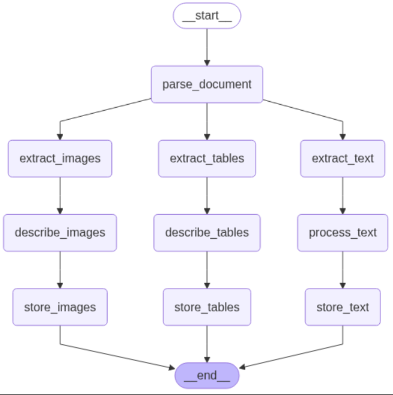
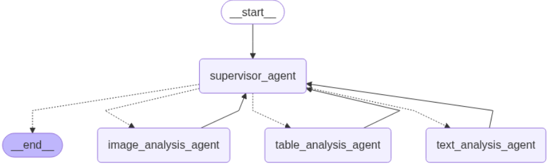

# System Architecture Documentation

## High-Level System Architecture

### Phase 1: Document Processing Pipeline


### Phase 2: Multi-Agent Query System


## System Overview

This is a sophisticated multi-modal PDF processing and query system that combines document parsing, knowledge extraction, vector storage, and intelligent querying through specialized AI agents. The system is designed to handle complex academic papers and technical documents containing text, images, tables, and figures.

## Detailed Workflow

### Phase 1: Document Processing Pipeline

#### 1. Document Parsing (`nodes/parsing_document_node.py`)
```
PDF Input → Unstructured Partition → Raw Elements + Text Chunks
```

**Process:**
- Uses `unstructured` library's `partition_pdf` with `hi_res` strategy
- Extracts all elements (text, images, tables) with full metadata
- Creates semantic text chunks using "by_title" strategy
- Maintains dual processing: raw elements for extraction + chunked text for storage

**Design Decision:** Dual processing approach allows complete element extraction while maintaining readable text chunks for retrieval.

#### 2. Parallel Content Extraction

**Image Extraction (`nodes/image_nodes/image_extrator_node.py`)**
- Identifies `Image` and `Figure` elements
- Captures base64-encoded image data
- Associates with figure captions when available
- Preserves source document metadata

**Table Extraction (`nodes/table_nodes/table_extractor_node.py`)**
- Identifies `Table` elements
- Extracts both HTML structure and raw text
- Preserves table formatting for analysis
- Maintains structural integrity

**Text Extraction (`nodes/text_nodes/text_extractor_node.py`)**
- Processes `CompositeElement` chunks
- Maintains semantic coherence through chunking strategy
- Preserves element type information

#### 3. Content Enhancement

**Image Description (`nodes/image_nodes/describe_image_node.py`)**
- Uses LLM to generate detailed image descriptions
- Combines figure captions with visual analysis
- Creates searchable text representations of visual content

**Table Description (`nodes/table_nodes/describe_table_node.py`)**
- Analyzes table structure and content
- Identifies trends, patterns, and key insights
- Generates natural language summaries

**Text Processing (`nodes/text_nodes/describe_text_node.py`)**
- Adds metadata (word count, character count)
- Timestamps processing
- Prepares for vector storage

#### 4. Knowledge Storage

**Vector Storage for Text and Images**
- Uses ChromaDB with HuggingFace embeddings (`all-MiniLM-L6-v2`)
- Separate collections for text chunks and image descriptions
- Enables semantic similarity search
- Persistent storage for retrieval

**SQL Storage for Tables**
- SQLite database for structured table data
- Preserves HTML formatting and metadata
- Enables precise table queries
- Stores table descriptions for context

### Phase 2: Multi-Agent Query System

#### Agent Architecture

**Supervisor Agent (`chatbot/main.py`)**
- Orchestrates query routing and response synthesis
- Uses LangGraph for workflow management
- Maintains conversation context
- Ensures quality control

**Specialized Sub-Agents:**

1. **Text Analysis Agent (`chatbot/subagents/text_analysis_agent.py`)**
   - Handles text-based queries
   - Uses vector retrieval for relevant context
   - Provides academic-rigor responses
   - Cites source documents

2. **Image Analysis Agent (`chatbot/subagents/image_analysis_agent.py`)**
   - Processes visual content queries
   - Retrieves image descriptions
   - Connects visual concepts to textual information
   - Maintains objectivity in assessments

3. **Table Analysis Agent (`chatbot/subagents/table_analysis_agent.py`)**
   - Handles data analysis queries
   - Queries SQL database for table content
   - Identifies patterns and trends
   - Quantifies findings

## Data Models

### Document Processing State (`orchestration/states.py`)
```python
class DocumentProcessingState(TypedDict):
    document_path: str
    raw_chunks: List[Any]              # Unstructured elements
    text_chunks: List[Any]             # Chunked text
    images: List[Dict[str, Any]]       # Extracted images
    tables: List[Dict[str, Any]]       # Extracted tables
    text_data: List[Dict[str, Any]]    # Text chunks
    processed_images: List[Dict[str, Any]]  # Enhanced images
    processed_tables: List[Dict[str, Any]]  # Enhanced tables
    processed_text: List[Dict[str, Any]]    # Enhanced text
    storage_status: List[str]          # Storage results
    processing_status: str             # Current status
```

### Storage Models

**Vector Store Metadata:**
- Text chunks: `{index, element_type, source_document, word_count, char_count, processed_at, json_path}`
- Images: `{image_path, metadata_path, source_document, processed_at}`

**SQL Table Schema:**
```sql
CREATE TABLE table_metadata (
    id INTEGER PRIMARY KEY AUTOINCREMENT,
    table_id TEXT UNIQUE,
    description TEXT,
    html_content TEXT,
    source_document TEXT,
    created_at TIMESTAMP DEFAULT CURRENT_TIMESTAMP
)
```

## Design Decisions & Rationale

### 1. Choice of Unstructured Library
**Decision:** Use `unstructured` for PDF processing
**Rationale:** 
- Best-in-class support for complex document layouts
- Native table structure inference
- Reliable image extraction with base64 encoding
- Semantic chunking strategies

### 2. Multi-Modal Storage Strategy
**Decision:** Different storage systems for different content types
**Rationale:**
- **Vector DB (ChromaDB):** Optimal for semantic similarity search of text and image descriptions
- **SQL Database:** Better for structured table queries and precise data retrieval
- **File System:** Preserves original images and detailed metadata

### 3. Agent Architecture
**Decision:** Supervisor + Specialized Sub-Agents
**Rationale:**
- **Modularity:** Each agent specialized for specific content types
- **Scalability:** Easy to add new agents or modify existing ones
- **Quality Control:** Supervisor ensures response consistency
- **Flexibility:** Dynamic agent selection based on query type

### 4. Technology Stack Choices

**LangGraph:**
- State management for complex workflows
- Parallel processing capabilities
- Easy workflow visualization and debugging

**ChromaDB + HuggingFace Embeddings:**
- Local deployment (no API dependencies)
- Fast similarity search
- Persistent storage
- Cost-effective for development

**Groq + LangChain:**
- Fast inference for real-time responses
- Consistent API interface
- Good performance for text generation

**SQLite:**
- Zero-configuration database
- Perfect for local development
- ACID compliance for data integrity
- Easy table querying

## Assumptions Made

1. **Document Format:** Primary focus on academic papers and technical documents
2. **Language:** English-language documents (embedding model optimized for English)
3. **Scale:** Designed for single-document processing (extensible to batch processing)
4. **Environment:** Local development environment with moderate computational resources
5. **Content Types:** Assumes documents contain mix of text, images, and tables

## Innovative Approaches & Challenges

### 1. Parallel Content Processing
**Innovation:** LangGraph enables true parallel processing of different content types
**Challenge:** State management across parallel branches
**Solution:** Used TypedDict with operator.add for state accumulation

### 2. Multi-Modal Vector Storage
**Innovation:** Separate but connected vector stores for different content types
**Challenge:** Maintaining relationships between related content
**Solution:** Consistent metadata linking and cross-referencing

### 3. Robust Error Handling
**Innovation:** Graceful degradation at each processing stage
**Challenge:** Ensuring partial success doesn't break entire pipeline
**Solution:** Try-catch blocks with detailed error reporting and status tracking

### 4. Dynamic Agent Selection
**Innovation:** Intelligent routing based on query analysis
**Challenge:** Determining appropriate agent for ambiguous queries
**Solution:** Supervisor with explicit routing rules and fallback mechanisms

## Code Architecture Patterns

### 1. Dependency Injection
- Models initialized once and passed to agents
- Vector stores as singletons with lazy initialization
- Configurable through environment variables

### 2. State Machine Pattern
- LangGraph workflows as finite state machines
- Clear state transitions and error handling
- Reproducible processing pipelines

### 3. Tool Pattern
- LangChain tools for database and retrieval operations
- Standardized input/output interfaces
- Easy testing and mocking

### 4. Factory Pattern
- Workflow creation through factory functions
- Agent initialization through factory methods
- Consistent configuration management

## Future Improvements & Extensions

### 1. Enhanced Multi-Modal Understanding
- **Vision-Language Models:** Integrate models like GPT-4V for direct image analysis
- **Cross-Modal Retrieval:** Find text based on image content and vice versa
- **Relationship Mapping:** Automatically link related content across modalities

### 2. Advanced Analytics
- **Trend Analysis:** Time-series analysis of table data
- **Citation Networks:** Build knowledge graphs from document references
- **Content Summarization:** Generate executive summaries across documents

### 3. Scalability Improvements
- **Batch Processing:** Handle multiple documents simultaneously
- **Distributed Storage:** Scale to enterprise vector databases
- **Caching Layer:** Redis for frequently accessed content
- **API Layer:** RESTful API for external integrations

### 4. User Experience Enhancements
- **Interactive Visualizations:** Dynamic charts and graphs from table data
- **Document Annotation:** Allow users to add notes and highlights
- **Export Capabilities:** Generate reports in various formats
- **Collaborative Features:** Multi-user document analysis

### 5. Advanced AI Capabilities
- **Fine-tuned Models:** Domain-specific models for technical documents
- **Active Learning:** Improve retrieval based on user feedback
- **Automated Fact-Checking:** Cross-reference claims across documents
- **Intelligent Summarization:** Generate section-wise summaries

### 6. Production Readiness
- **Authentication & Authorization:** Secure access control
- **Monitoring & Logging:** Comprehensive observability
- **Performance Optimization:** Query optimization and caching
- **Data Privacy:** PII detection and redaction

## Security & Privacy Considerations

1. **Local Processing:** All data processed locally, no external API calls for sensitive content
2. **Data Encryption:** Consideration for encrypting stored vector data
3. **Access Control:** Role-based access to different document types
4. **Audit Logging:** Track all document processing and query activities

## Performance Characteristics

- **Processing Speed:** ~2-5 minutes for typical academic paper (10-20 pages)
- **Storage Efficiency:** Vector compression for large document collections
- **Query Performance:** Sub-second response times for most queries
- **Memory Usage:** Optimized for systems with 8GB+ RAM

This architecture provides a robust foundation for multi-modal document processing while maintaining flexibility for future enhancements and scale requirements.
